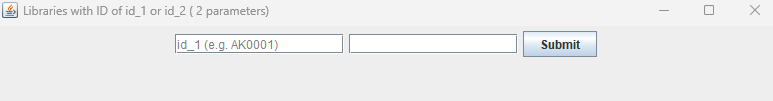

# COMP 3380 Group Project  
## US Libraries Analytics  

#### Group Members
Xiaoran Meng, Ethan, Frieda  

#### Github Repository  
_Here you can view the hosted README_  
**https://github.com/xiaoran-MENG/comp3380-group-project**  

#### Live Demo  
  

#### Programming Paradigms
The source code was written in `Java` using _Object_Oriented_Programming_ supplemented by elements (functional interfaces) of _Functional Programming_ in `Java 8+` 

#### Running the Analytics  
1. Run `make` from the project folder to compile the source files 
2. Run `make run` if the compilation is successful  

#### Execution Process
1. A popup is displayed to let the user choose whether or not to seed the database  
      
    _Note: if you close the popup without having the database seeded, the database will **automatically** get seeded after you choose your first report to display_  
2. The reports directory is displayed in the terminal, waiting on the user to enter a report index  
      
3. The analytics then runs the corresponding query executor to fetch data for the selected report  
      
    _Note: if the user chooses a report that requires user-defined parameters, a form is displayed to take in the parameters from the user. `Mousing over` the text fields would trigger display of `parameter name` and a `suggested value`_
    
4. The search results are tabulated with a scrollbar on the right  
      

5. Repeat `2` until the user enters `q`    
      